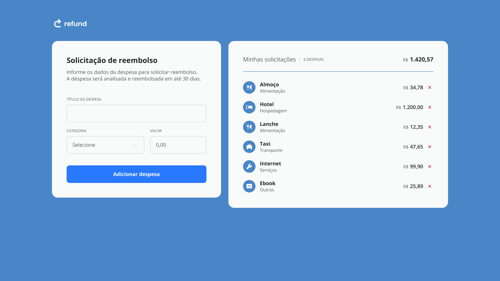

<h1 align="center">💸 Refund App v2.0 - Reimagined</h1>

<p align="center">
  Expense reimbursement system, rebuilt and enhanced as part of the Rocketseat Fullstack formation, focusing on deepening JavaScript concepts and usability.
</p>

<p align="center">
  <a href="#-about-the-project">About</a>&nbsp;&nbsp;&nbsp;|&nbsp;&nbsp;&nbsp;
  <a href="#-key-features">Features</a>&nbsp;&nbsp;&nbsp;|&nbsp;&nbsp;&nbsp;
  <a href="#-technologies">Technologies</a>&nbsp;&nbsp;&nbsp;|&nbsp;&nbsp;&nbsp;
  <a href="#-layout-and-design">Layout & Design</a>&nbsp;&nbsp;&nbsp;|&nbsp;&nbsp;&nbsp;
  <a href="#-how-to-run">How to Run</a>&nbsp;&nbsp;&nbsp;|&nbsp;&nbsp;&nbsp;
  <a href="#-license">License</a>
</p>

<p align="center">
  
</p>

<br>

<p align="center">
  
</p>

---

## 🚀 About the Project

The Refund App is an intuitive web application for managing reimbursement requests and tracking expenses. Initially developed as part of the JavaScript specialization module of the Rocketseat Fullstack formation, this project has been **revisited and enhanced** to consolidate and deepen acquired knowledge.

My main motivations for rebuilding this project were:
* **Solidify Advanced JavaScript Concepts:** Dynamic DOM manipulation, event handling, real-time data validation and formatting, calculation logic, and code organization.
* **Improve User Experience:** Implementing more robust validations, visual feedback, and usability enhancements like automatic form clearing and intelligent focus.
* **Design Customization:** Reworking the color palette and visual components (from green to blue) for a more modern touch, aligned with my aesthetic preferences and recent Figma knowledge.
* **Detailed Documentation:** The creation of a comprehensive `notes.md` with a step-by-step breakdown of each feature's construction serves as a study and review material for future reference.

This project simulates a real-world expense tracking workflow, reinforcing front-end logic understanding and preparing for more complex challenges.

In future iterations, I plan to explore data persistence (with LocalStorage or a backend), add filtering, expense editing, and potentially implement authentication.

## ✨ Key Features

* **Value Input Validation:** Accepts only numbers, refined via Regex.
* **Dynamic Currency Formatting:** Converts values to the Brazilian Real (R$) standard in real-time.
* **Expense Addition:** Captures form data and dynamically creates new records in the list.
* **Detailed Display:** Each expense is rendered with a title, category (with corresponding icon), and value.
* **Expense Removal:** Allows deleting specific items from the list.
* **Totals Update:** Displays the total quantity of expenses and the consolidated total value in real-time.
* **Enhanced Usability:** Automatic form clearing and input field focusing after submission.

---

## 🛠 Technologies

This project was developed using the following technologies:

* **HTML5**
* **CSS3**
* **JavaScript (ES6+)** - DOM Manipulation, Events, Functions, Objects, Loops, Regex.
* **Git & GitHub** - Version control and hosting.
* **Figma** - For design and UI customization.
* **Responsiveness** - Techniques for adapting to different screen sizes (if applicable, if you worked on this).

---

## 🔗 Live Project & Classes

➡️ **[Access the live version](https://andreskull2.github.io/refund-v2/)**
🎓 **[Watch the original Rocketseat formation classes](https://www.rocketseat.com.br/formacao/fullstack)**

---

## 🎨 Layout and Design

The initial layout was provided by Rocketseat, but it was **customized** with a new color palette (from green to blue) and adjustments to components for a refreshed visual experience.

You can check out the original layout here:
🔗 [View on Figma (original)](https://www.figma.com/community/file/1360316109107378379) *(requires a Figma account)*

---

## 💻 How to Run

To get a local copy of the project and run it:

1.  **Clone this repository:**
    ```bash
    git clone [https://github.com/andreskull2/refund-v2.git](https://github.com/andreskull2/refund-v2.git)
    ```
2.  **Access the project folder:**
    ```bash
    cd refund-v2
    ```
3.  **Open the `index.html` file** in your preferred browser.

---

## :memo: License

This project is licensed under the **MIT License**. Feel free to use it as a reference or learning material — just remember to give credit where it's due.

---

Made with ♥ by Rocketseat — Rebuilt and enhanced with care by @andreskull2 🚀

:wave: [Join our community!](https://discord.gg/rocketseat)